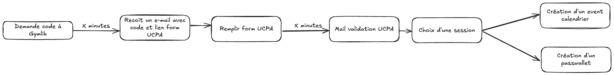

# Gymlib UCPA Facilitator

Ce projet a pour but de me faire gagner du temps lors de mes réservations UCPA via Gymlib.

Voici les différentes étapes pour pouvoir préparer correctement sa venue :



Le projet est composé actuellement de 3 grandes étapes :

1. Vérifier qu'une nouvelle réservation a été demandée sur Gymlib
2. Remplir le formulaire de contremarque UCPA
3. Recevoir une notification dès que l'UCPA a validé les informations avec des créneaux arrangeants qui sont disponibles

A venir :

1. Créer un évènement de calendrier et créer un pass Apple Wallet
2. Me notifier de créneaux qui m'arrangent qui se libèrent

La réservation du créneau se fait donc toujours manuellement sur le site de l'UCPA, mais toutes les étapes contraignantes
et d'attente sont désormais automatisées.

## Usage

1. Copier le sample.env dans un fichier .env

```shell
cp sample.env .env
```

2. Renseigner les différentes variables d'environnement
3. Installer les paquets

```shell
npm ci
```

4. Lancer la base de donnée

```shell
docker compose up -d
```

5. Créer la base de donnée

```shell
npm run db:prepare
```

6. Lancer le projet

```shell
npm start
```
